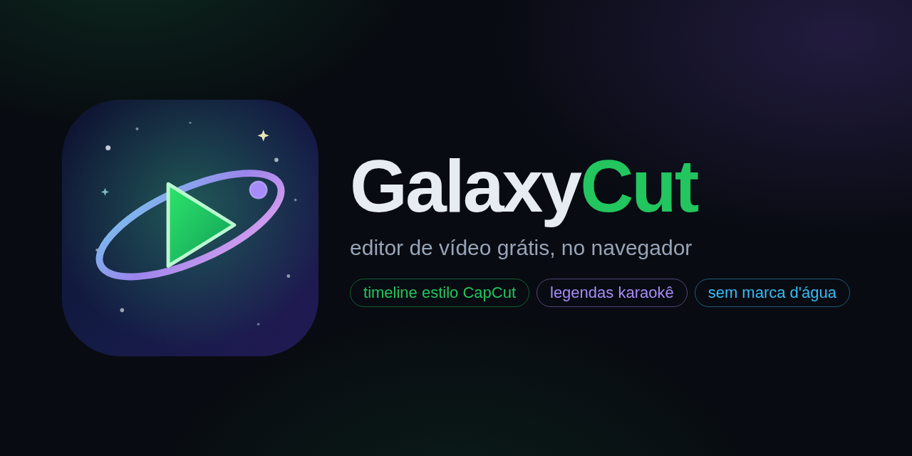

# GalaxyCut

<p align="center">
  
</p>

**Editor de vídeo gratuito que roda 100% no seu navegador** (e também como app de desktop). Timeline com faixas estilo CapCut, legendas automáticas karaokê com Whisper local, detector de silêncio, gravação de voz, busca de músicas e efeitos livres — e **sem marca d'água**.

- Web: **https://lucasgabrieldevgg.github.io/galaxycut/**
- Releases (AppImage Linux + Instalador Windows): **https://github.com/lucasgabrieldevgg/galaxycut/releases**

## Por que usar

- Grátis, sem conta, sem marca d'água, sem assinatura.
- Seus arquivos ficam **no seu navegador** — nada sobe pra nuvem.
- Legendas automáticas com **IA local** (Whisper roda no seu próprio PC, via WebAssembly).
- Feito pra quem edita **shorts de game** (9:16, 1:1 e 16:9).

## Funcionalidades

- **Timeline multi-faixa** — vídeo, áudio e texto; arraste livre, corte na setinha, apare bordas, encaixe magnético, transições e fades.
- **Multi-projeto** — página inicial com suas edições: criar, renomear, duplicar e excluir.
- **Detector de silêncio** — acha os trechos sem fala e você escolhe: excluir, silenciar ou esconder a cena. Aplica em todos os clipes do arquivo e a "vassoura" apaga de uma vez os pedaços sem som.
- **Extrair áudio** — destaca o áudio de um vídeo como arquivo WAV próprio, reutilizável.
- **Legendas karaokê** — transcrição palavra por palavra (Whisper local) com 8 estilos prontos estilo CapCut; a palavra falada pulsa na tela.
- **Melhorar áudio** — cadeia de estúdio (limpeza de ruído + compressor + limitador) num clique.
- **Gravar voz** — narração direto no editor, com medidor de nível em decibéis (estilo OBS).
- **Busca de mídia livre** — fotos, vídeos, músicas e efeitos de bancos abertos (Openverse, Freesound, Wikimedia Commons, Internet Archive, Jamendo; Pexels e Pixabay com chave opcional). Busque em português — a tradução é automática.
- **Exportação 1080p** — MP4/WebM em 30 ou 60 fps, sem marca d'água; legendas em `.srt`.
- **Verificador de atualizações** — o app avisa quando sai versão nova e mostra o changelog.
- **Atalhos editáveis** — rebind de teclas nas configurações.

## Instalação

### Web (recomendado)

Abra **https://lucasgabrieldevgg.github.io/galaxycut/** no Chrome/Edge atualizado. Não precisa instalar nada.

### Linux (AppImage)

1. Baixe o `GalaxyCut-<versão>-x86_64.AppImage` na [página de releases](https://github.com/lucasgabrieldevgg/galaxycut/releases/latest).
2. Dê permissão de execução: `chmod +x GalaxyCut-*.AppImage`
3. Dê dois cliques. Os vídeos exportados ficam em `~/Vídeos/GalaxyCut/` com nomeação própria (`GalaxyCut_YYYY-MM-DD_HH-MM-SS.mp4`) — nunca sobrescreve seus outros vídeos.

### Windows

Baixe o `GalaxyCut-Setup-<versão>.exe` nos [releases](https://github.com/lucasgabrieldevgg/galaxycut/releases/latest) e instale.

## Desenvolvimento

```bash
npm ci
npm run dev          # editor em http://localhost:3000
npm run build        # build estático em out/
npm run typecheck    # tipos
```

O app é 100% estático (sem servidor): pode hospedar em qualquer CDN.

### App de desktop (Electron)

```bash
npm run build                                # gera out/
mkdir -p desktop/www && cp -r out/* desktop/www/
cd desktop && npm ci && npx electron .       # roda o app
npx electron-builder --linux AppImage        # gera o AppImage
npx electron-builder --win nsis              # gera o instalador Windows
```

### Publicar versão nova

1. Atualize `src/lib/editor/changelog.json` (versão + itens) e o `version` do `package.json`.
2. Commit na `main` (o site república sozinho no GitHub Pages).
3. `git tag vY.Z.K && git push origin vY.Z.K` — o GitHub Actions builda AppImage + Windows e cria o Release com o `latest.json` (o app usa isso pra avisar os usuários e mostrar o changelog).

## Estrutura

```
src/app/                 app Next.js (uma página, export estático)
src/components/editor/   todo o editor (timeline, painéis, home, diálogos)
src/lib/editor/          núcleo: store, playback, render, exportação, busca,
                         projetos, legendas (Whisper local), atualizador
desktop/                 app de desktop (Electron + AppImage/NSIS)
.github/workflows/       Pages (site), Release (desktop) e CI
```

## Licença

MIT — veja [LICENSE](LICENSE). As mídias encontradas na busca pertencem aos seus criadores e seguem as licenças dos bancos de origem (os selos de licença aparecem em cada resultado).
